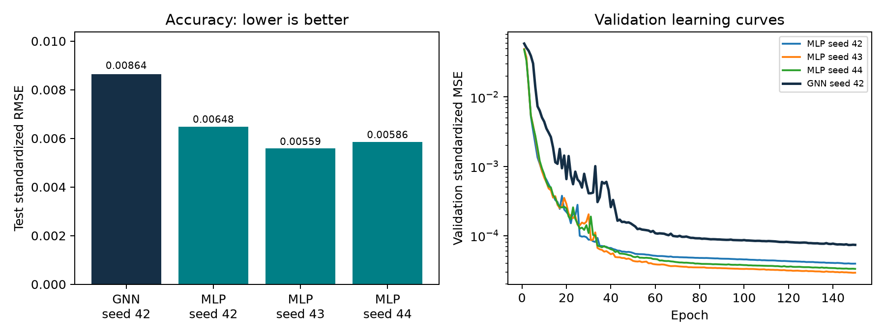

# Mechanical Design Assistant using Graph Neural Networks

A TensorFlow graph neural network for predicting forces and moments in a tooth wheel, shaft, and bearing-support assembly. The project combines analytical equilibrium, synthetic data generation, graph regression, and reproducible model evaluation.

**30,000 synthetic cases | 19 outputs | 86,547 GNN parameters | 8 unit tests**

[Graph schema](SCHEMA.md) | [GNN results](artifacts/RESULTS.md) | [Benchmark data](benchmarks/comparison.json)


## Features

- Four-node mechanical graph with twelve directed interaction edges.
- Analytical force and moment calculations for all three bodies.
- Train/validation/test separation and training-only target normalization.
- Three-round message-passing network with a graph-level regression head.
- Saved GNN weights, synthetic dataset, predictions and evaluation metrics.
- Parameter-matched MLP baselines and analytical-solver inference benchmarks.
- Tests for equilibrium, serialization, batching, node permutation and checkpoint loading.

## Quick start

Use Python **3.12**. Open Command Prompt or PowerShell in this folder:

```text
py -3.12 -m venv .venv
.venv\Scripts\python.exe -m pip install -r requirements.txt
.venv\Scripts\python.exe predict.py
```

No environment activation is required. If the `py` launcher is unavailable, use `python -m venv .venv` with Python 3.12 on PATH.

For Linux/macOS:

```bash
python3.12 -m venv .venv
.venv/bin/python -m pip install -r requirements.txt
.venv/bin/python predict.py
```

Tested on Windows CPU with Python 3.12.14, TensorFlow 2.16.1 and TF-GNN 1.0.3. The source selects the Keras 2 API through `TF_USE_LEGACY_KERAS=1` before importing TensorFlow. Use a fresh notebook kernel if TensorFlow has already been imported. The GitHub Actions workflow is configured for Linux; a hosted CI run is not claimed here.

## Predict a load case

```text
.venv\Scripts\python.exe predict.py --force 40 60 -30 --geometry 0.08 0.16 0.05 -0.08
```

| Argument | Components | Units |
|---|---|---|
| `--force` | Fx, Fy, Fz at point A on the tooth wheel | N |
| `--geometry` | Wheel position d, bearing spacing L, wheel radius r, support coordinate gz | m |

Require `0 < d < L` and `r > 0`. Convert millimetres to metres. The command prints the GNN prediction, analytical reference and unit for each quantity. It supports a single force at A with arbitrary signed components; loads on arbitrary bodies or multiple application points are outside this model's input schema.

## Mechanical formulation

The shaft follows the x-axis. Body 1 is the tooth wheel, body 2 the shaft, body 3 the support, and E the environment.

Force and moment subscripts follow **point of action, destination body, source body**. Thus `F_D12` is the force at D **on wheel 1 from shaft 2**, and `F_A1E` is the applied force at A **on wheel 1 from environment E**. The corresponding graph arrows are `2 -> 1` and `E -> 1`. Cartesian vector direction is specified separately by the X/Y/Z components. Both the interaction diagram and assembly drawing are included in [SCHEMA.md](SCHEMA.md).

| Point | Coordinates | Role |
|---|---|---|
| B | (0, 0, 0) | Locating bearing |
| D | (d, 0, 0) | Tooth wheel/shaft interface |
| C | (L, 0, 0) | Floating bearing |
| A | (d, 0, r) | Applied-force location |
| G | (0, 0, gz) | Support/environment connection |

In the assembly drawing, `X_ab = d`, `X_bc = L`, `X_c = L - d`, and `Z_a = r`. The code's `R_cx` is the full coordinate `L`, not the drawing's D-to-C distance `X_c`.

B carries three force components; C carries radial y/z forces, with `F_C23X = 0`. Neither bearing carries a reaction couple. An external drive/brake torque balances shaft torsion. The support connection G transmits force and moment.

Let `F = F_A1E` and `Q = A cross F`. Receiving-body conventions:

```text
F_D12 = -F                          # force on tooth wheel from shaft
M_D12 = -(A-D) cross F              # moment on tooth wheel from shaft
F_C23 = (0, -Qz/L, Qy/L)            # force on shaft from support at C
F_B23 = -F - F_C23                  # force on shaft from support at B
M_C2EX = -Qx                        # external torque on shaft
F_G3E = F_B23 + F_C23               # environment force on support
M_G3E = C cross F_C23 - G cross F_G3E
```

The shaft receives `-F_D12` and `-M_D12`; the support receives `-F_B23` and `-F_C23`. `mechanics.residuals()` evaluates independent force and moment balances for all three bodies.

Output order: `F_D12[XYZ]`, `M_D12[XYZ]`, `F_B23[XYZ]`, `F_C23[XYZ]`, `M_C2EX`, `F_G3E[XYZ]`, `M_G3E[XYZ]`. Forces are in N and moments in N m. `M_D12Z` and `F_C23X` are identically zero for this geometry.

## Dataset and model

| Input | Sampling range |
|---|---|
| Fx, Fy, Fz | Independently uniform [-100, 100] N |
| L | Uniform [0.12, 0.24] m |
| d/L | Uniform [0.2, 0.8] |
| r | Uniform [0.025, 0.09] m |
| gz | Uniform [-0.09, -0.04] m |

The seed-42 dataset contains 30,000 cases, split into 24,000 training, 3,000 validation and 3,000 test cases using saved indices. Node features encode body identity and reference coordinates. Edge features encode interaction type, location, known force and direction. Unknown reactions are targets, never inputs.

The GNN uses 64-dimensional node/edge embeddings, three message-passing rounds, sum aggregation, sum graph pooling, a 128-unit readout and 19 linear outputs. Training uses Adam and standardized MSE, batch size 256 and up to 150 epochs. Validation chooses the checkpoint; the saved checkpoint is epoch 147. See [SCHEMA.md](SCHEMA.md) for tensor shapes and serialization details.

## Results

Mean R2 averages the 17 nonconstant outputs. Constant-output MAE/RMSE are included in the detailed results; their R2 is undefined.

| Model | Parameters | Test mean R2 | Standardized test RMSE |
|---|---:|---:|---:|
| GNN, seed 42 | 86,547 | 0.999918 | 0.008641 |
| MLP, seed 42 (primary baseline) | 86,195 | 0.999954 | 0.006482 |
| MLP, seed 43 | 86,195 | 0.999966 | 0.005590 |
| MLP, seed 44 | 86,195 | 0.999963 | 0.005862 |
| Affine regression | - | 0.942025 | 0.229245 |

The MLP uses the same seven physical inputs, saved splits, target scaling and training policy. Its hidden widths are 208, 208 and 180, with swish activations. Seed 42 is the prespecified primary comparison. Three MLP seeds versus one GNN seed does not constitute a matched multi-seed architecture study.

Median resident CPU inference latency, including validation, input preparation and neural-output rescaling:

| Cases per batch | Analytical | MLP | GNN |
|---|---:|---:|---:|
| 1 | 0.342 ms | 1.296 ms | 13.218 ms |
| 256 | 0.285 ms | 1.673 ms | 14.334 ms |
| 3,000 | 0.701 ms | 5.941 ms | 72.573 ms |

Measured on Windows CPU with four TensorFlow intra-operation threads, five warmups and 60 randomized/interleaved repetitions per method and batch size. Imports, checkpoint loading, tracing, disk I/O and console output are excluded. The GNN benchmark uses vectorized graph construction. These are host-specific measurements, not deployment guarantees. Full distributions are in [timing_raw.json](benchmarks/timing_raw.json).



## Tests and reproducibility

```text
.venv\Scripts\python.exe -m unittest discover -s tests -v
.venv\Scripts\python.exe verify_artifacts.py artifacts
.venv\Scripts\python.exe train.py --samples 30000 --epochs 150 --seed 42 --out runs/gnn
.venv\Scripts\python.exe predict.py --artifacts runs/gnn
.venv\Scripts\python.exe compare_models.py --artifacts artifacts --out runs/comparison
```

Use a new directory for each experiment. A training smoke test can use `--samples 200 --epochs 2`; this checks execution, not accuracy. The comparison command trains the three MLPs and evaluates a fixed GNN checkpoint. On Linux/macOS use `.venv/bin/python`.

`artifacts/dataset.npz` contains physical inputs `x`, labels `y`, and `train`, `validation`, `test` indices. The model weights and training-only target scales are included. TFRecords are generated during training and excluded from version control. Benchmarks include per-seed weights, predictions, histories and raw timing samples.

## Scope and limitations

This is a synthetic rigid-body equilibrium benchmark with a fixed graph topology. Gravity, inertia, compliance, material stress, fatigue, bearing life and CAD generation are not modeled. Fixed-topology accuracy does not establish transfer to other assemblies. Predictions are not projected onto equilibrium and can have nonzero physical residuals.

The analytical solver is faster and exact within these assumptions. The MLP has lower test error in this benchmark. The GNN demonstrates a mechanical graph-learning pipeline, but these results do not establish an accuracy or speed advantage over the alternatives. Real-world engineering validation requires suitable physical models and measurements.

## Repository layout

```text
mechanics.py           Equilibrium, sampling and residuals
graph_data.py          Graph features, TFRecord serialization and datasets
model.py               GNN architecture
train.py               Training, checkpoint selection and evaluation
predict.py             Saved-model inference
compare_models.py      MLP training and inference timing
verify_artifacts.py    Dataset and checkpoint verification
report_results.py      Metrics tables and plots
tests/                 Unit tests
artifacts/             GNN checkpoint, dataset and results
benchmarks/            MLP models and comparison results
.github/workflows/     Automated test configuration
```

## Project team

Abhijeet Singh Sandhu and Sricharan Sammeta. Supervisor: Prof. Dr. Michael Wagner, Technical University of Rosenheim. See [AUTHORS.md](AUTHORS.md).

## References

- [TensorFlow GNN](https://github.com/tensorflow/gnn)
- [TF-GNN input pipeline](https://github.com/tensorflow/gnn/blob/main/tensorflow_gnn/docs/guide/input_pipeline.md)
- [TF-GNN modeling guide](https://github.com/tensorflow/gnn/blob/main/tensorflow_gnn/docs/guide/gnn_modeling.md)

## License

A software license has not been specified.
