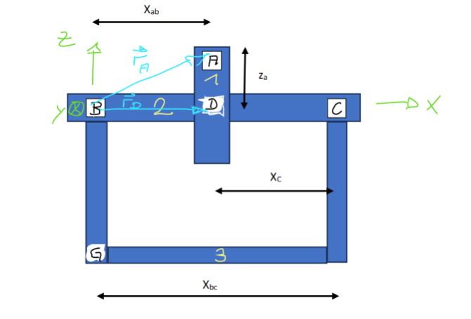
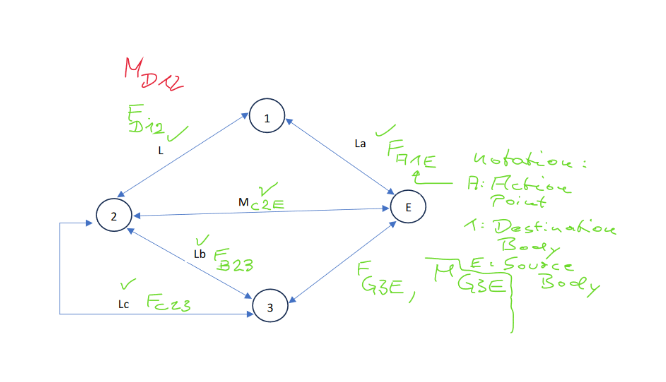

# Mechanical graph and data schema

## Mechanical assembly and contact points



| Body | Component |
|---|---|
| 1 | Tooth wheel |
| 2 | Shaft |
| 3 | Support, including the bearings |
| E | Environment; not a physical point with a coordinate |

| Point | Physical meaning | Coordinate used by the model |
|---|---|---|
| A | Applied-force location on the tooth wheel | `(d, 0, r)` |
| B | Shaft-support contact at the locating bearing | `(0, 0, 0)` |
| C | Shaft-support contact at the floating bearing | `(L, 0, 0)` |
| D | Tooth wheel-shaft contact | `(d, 0, 0)` |
| G | Support-environment contact | `(0, 0, gz)` |

The shaft lies along x; z points upward. Positions are in metres, forces in N, and moments in N m. The drawing is a reference sketch, not a scale drawing or a restriction on the force vector: the model accepts all three signed Cartesian force components at A.

The sketch's `X_ab` maps to `d`, the axial B-to-D distance (A and D have the same x-coordinate). `X_bc` maps to `L`, the full B-to-C bearing span. The sketch's `X_c` marks the **D-to-C distance, `L - d`**; it is not the code's `R_cx`, which is C's x-coordinate measured from B and equals `L`. `Z_a` maps to `r`. The input `gz` is G's z-coordinate relative to B, negative for the depicted support below the shaft.

## Interaction diagram and nomenclature



Read a force symbol as **`F` + point of action + destination body + source body**. A moment uses the same order with `M`.

```text
F_Pij = force at point P, acting ON body i, exerted BY body j
M_Pij = moment at point P, acting ON body i, exerted BY body j
Graph arrow: source j -> destination i
```

The written body order is **destination then source**; the graph arrow runs **source to destination**. It does not specify a Cartesian direction. The physical vector direction is given by signed X/Y/Z components. The suffix in `F_A1EX` is therefore A (point), 1 (destination), E (source), X (component).

| Symbol | Meaning | Associated graph direction |
|---|---|---|
| `F_A1E` | Force at A on wheel 1, exerted by environment E | `E -> 1` |
| `F_D12` | Force at D on wheel 1, exerted by shaft 2 | `2 -> 1` |
| `M_D12` | Moment at D on wheel 1, exerted by shaft 2 | `2 -> 1` |
| `F_B23` | Force at B on shaft 2, exerted by support 3 | `3 -> 2` |
| `F_C23` | Force at C on shaft 2, exerted by support 3 | `3 -> 2` |
| `M_C2E` | External drive/brake moment on shaft 2 from environment E, associated with C | `E -> 2` |
| `F_G3E` | Force at G on support 3, exerted by environment E | `E -> 3` |
| `M_G3E` | Moment at G on support 3, exerted by environment E | `E -> 3` |

Only the x-component of `M_C2E` is needed for this shaft model, so it is stored as `M_C2EX`. This external torque is distinct from the C bearing interaction: the ideal floating bearing itself has no reaction couple.

At a shared contact, action and reaction have opposite signs: `F_D21 = -F_D12`, `M_D21 = -M_D12`, `F_B32 = -F_B23` and `F_C32 = -F_C23`. Likewise, `F_AE1 = -F_A1E` is the wheel's reaction on the environment. The CLI input `--force Fx Fy Fz` is **`F_A1E`, the force on the wheel**.

For example, `F_A1E = (40, 60, -30) N` gives `F_D12 = (-40, -60, 30) N` by wheel force balance. The opposite force exerted by the wheel on the shaft is `F_D21 = (40, 60, -30) N`. These are two sides of the same interface, not two independently applied loads.

## Graph representation

One example is one assembly, with one graph component. Every graph has node set `bodies` of size 4 and edge set `interactions` of size 12. Geometry and forces vary; topology is fixed. Two opposite directed edges encode each physical interaction, but unknown reaction magnitudes are **not** input edge features.

## Nodes

| Index | Identity | Reference point |
|---:|---|---|
| 0 | Tooth wheel, body 1 | D |
| 1 | Shaft, body 2 | C/2 |
| 2 | Support, body 3 | G |
| 3 | Environment E | B/origin |

`bodies/features`: float32 `[4,7]`: four identity one-hot entries plus three reference coordinates divided by 0.1 m. Reference points are encoding choices, not mass centroids. Node identity is carried by features, so reordering nodes and remapping endpoints preserves predictions (tested).

Array indices start at zero: index 0 is body 1, index 1 is body 2, index 2 is body 3, and index 3 is E. The environment node's zero reference coordinate is an encoding placeholder; it does not move the support-environment contact from G to B. Contact positions are stored on the edges.

## Edges

| Edge rows | Type | Forward source -> target | Point |
|---|---|---|---|
| 0,1 | A applied force | E -> 1 | A |
| 2,3 | D tooth wheel/shaft | 2 -> 1 | D |
| 4,5 | B locating bearing | 3 -> 2 | B |
| 6,7 | C floating bearing | 3 -> 2 | C |
| 8,9 | External drive/brake torque | E -> 2 | C |
| 10,11 | G environment/support | E -> 3 | G |

The first row is forward; the next is reverse. B and C are distinct parallel graph connections. `interactions/features`: float32 `[12,14]` = location xyz / 0.1 m, six-way interaction one-hot, known force xyz / 100 N, known-force flag, direction (+1/-1). Only A has known applied force; its reverse has the opposite force. All unknown forces/couples remain zero placeholders distinguished by the known-force flag and edge type. This is a relational graph with a graph-level regression readout, not a learned reaction stored in each edge.

The direction feature identifies the forward/reverse member of the interaction pair. It is not a positive/negative Cartesian axis label. Both directed edges allow message passing; their existence does not duplicate physical loads in the equilibrium solver.

## Context and labels

Serialized `context/label`: float32 `[1,19]`, standardized using training-only statistics. `decode()` extracts its component row to `[19]` and replaces context features with `{}`. Batched labels are `[batch,19]`; batched graphs are merged into disjoint components in the model. No edges cross components.

Output order: `F_D12X,Y,Z`, `M_D12X,Y,Z`, `F_B23X,Y,Z`, `F_C23X,Y,Z`, `M_C2EX`, `F_G3EX,Y,Z`, `M_G3EX,Y,Z`. Force and couple directions follow the receiving-body conventions defined in the README.

`artifacts/graph_schema.pbtxt` is the machine-readable TF-GNN schema. `tfgnn.write_example()` manages feature names including `context/label`, `nodes/bodies.*` and `edges/interactions.*`. Each serialized example contains the context, graph sizes, node features, edge features, and endpoint indices. See the official [encoding and parsing guide](https://github.com/tensorflow/gnn/blob/main/tensorflow_gnn/docs/guide/input_pipeline.md).
