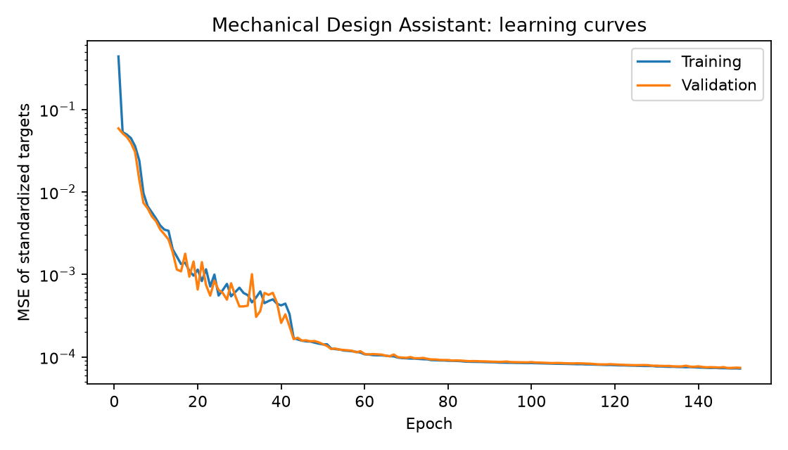
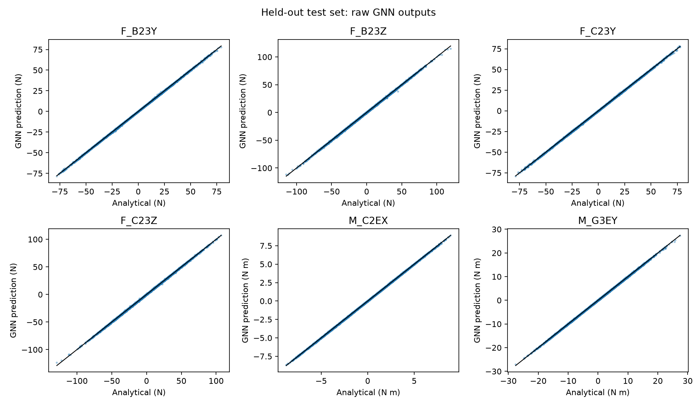

# Measured results

30,000-case experiment; actual split counts: {'train': 24000, 'validation': 3000, 'test': 3000}.
Best epoch: 147 of 150; 86,547 trainable parameters.

R2 below is the macro average over nonconstant outputs; constant-output R2 is undefined.

| Model / partition | Mean R2 | Standardized RMSE |
|---|---:|---:|
| validation | 0.999918 | 0.008570 |
| test | 0.999918 | 0.008641 |
| mean_baseline | -0.000191 | 0.948469 |
| linear_baseline | 0.942025 | 0.229245 |
| out_of_distribution | 0.996738 | 0.134600 |

## Test errors in physical units

| Output | Unit | MAE | RMSE | R2 |
|---|---|---:|---:|---:|
| F_D12X | N | 0.243261 | 0.323353 | 0.999968 |
| F_D12Y | N | 0.253649 | 0.340537 | 0.999965 |
| F_D12Z | N | 0.293612 | 0.389686 | 0.999954 |
| M_D12X | N m | 0.021421 | 0.028685 | 0.999934 |
| M_D12Y | N m | 0.028596 | 0.038141 | 0.999882 |
| M_D12Z | N m | 0.002660 | 0.003533 | undefined (constant) |
| F_B23X | N | 0.242066 | 0.328509 | 0.999967 |
| F_B23Y | N | 0.228152 | 0.321344 | 0.999888 |
| F_B23Z | N | 0.367921 | 0.519403 | 0.999798 |
| F_C23X | N | 0.002687 | 0.003667 | undefined (constant) |
| F_C23Y | N | 0.223517 | 0.318928 | 0.999893 |
| F_C23Z | N | 0.352765 | 0.504895 | 0.999814 |
| M_C2EX | N m | 0.022564 | 0.029606 | 0.999930 |
| F_G3EX | N | 0.229687 | 0.312623 | 0.999970 |
| F_G3EY | N | 0.265636 | 0.352788 | 0.999963 |
| F_G3EZ | N | 0.275180 | 0.363407 | 0.999960 |
| M_G3EX | N m | 0.026500 | 0.035443 | 0.999915 |
| M_G3EY | N m | 0.070618 | 0.096367 | 0.999888 |
| M_G3EZ | N m | 0.034842 | 0.049899 | 0.999923 |

## Equilibrium residuals of raw GNN predictions

| Body | Force RMS (N) | Moment RMS (N m) | Max abs force (N) | Max abs moment (N m) |
|---|---:|---:|---:|---:|
| tooth_wheel | 0.352315 | 0.042163 | 2.059230 | 0.387803 |
| shaft | 0.413699 | 0.070718 | 2.635184 | 0.686429 |
| support | 0.394547 | 0.093151 | 2.173925 | 1.189472 |

Analytical labels satisfy all three body balances to floating-point precision. GNN outputs are not projected onto equilibrium.
Errors measure agreement with synthetic rigid-body equations, not experimental validation or strength/fatigue safety.
The out-of-distribution set doubles applied loads and scales lengths by 1.4; it is a stress test, not a promised operating range.

## Example held-out cases

### Test example 1 (dataset ID 29471)

{'F_A1EX': -13.610882, 'F_A1EY': -79.786552, 'F_A1EZ': 67.484351, 'R_dx': 0.073946, 'R_cx': 0.187002, 'R_az': 0.075185, 'R_gz': -0.081762}

| Quantity | Analytical | Predicted |
|---|---:|---:|
| F_B23X | 13.61088 | 13.52617 |
| F_B23Y | 48.23663 | 48.47386 |
| F_B23Z | -35.32678 | -35.41394 |
| F_C23Y | 31.54992 | 31.34376 |
| F_C23Z | -32.15758 | -31.99528 |
| M_C2EX | -5.99874 | -6.01418 |
| M_G3EY | 7.12639 | 7.10923 |

### Test example 2 (dataset ID 21150)

{'F_A1EX': -8.0977, 'F_A1EY': -38.357653, 'F_A1EZ': -64.439871, 'R_dx': 0.087027, 'R_cx': 0.121889, 'R_az': 0.059938, 'R_gz': -0.057936}

| Quantity | Analytical | Predicted |
|---|---:|---:|
| F_B23X | 8.09770 | 7.77186 |
| F_B23Y | 10.97098 | 10.94534 |
| F_B23Z | 22.41298 | 22.76256 |
| F_C23Y | 27.38667 | 27.19999 |
| F_C23Z | 42.02689 | 41.60590 |
| M_C2EX | -2.29910 | -2.31764 |
| M_G3EY | -4.65347 | -4.67365 |

### Test example 3 (dataset ID 8277)

{'F_A1EX': -71.429823, 'F_A1EY': 62.580155, 'F_A1EZ': -57.348176, 'R_dx': 0.135166, 'R_cx': 0.176618, 'R_az': 0.062102, 'R_gz': -0.082038}

| Quantity | Analytical | Predicted |
|---|---:|---:|
| F_B23X | 71.42982 | 71.30661 |
| F_B23Y | -14.68749 | -14.51346 |
| F_B23Z | 38.57565 | 37.60450 |
| F_C23Y | -47.89267 | -47.92680 |
| F_C23Z | 18.77252 | 19.04006 |
| M_C2EX | 3.88638 | 3.91638 |
| M_G3EY | 2.54438 | 2.62211 |

